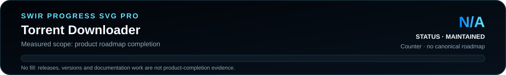

<!-- SWIR-README-STANDARD:v2 -->

<div align="center">


<br>


[](https://github.com/Swir)

[**Highlights**](#-highlights) · [**Quick Start**](#%EF%B8%8F-quick-start) · [**Progress**](#%EF%B8%8F-roadmap--progress) · [**Releases**](#-releases)

</div>

## 📍 Project Status

| Item | Status |
|---|---|
| Current stage | Legacy / maintained reference |
| Runtime | PHP web application + local Transmission RPC |
| Interface language | Polish |
| Latest public release | [v1.0.0](https://github.com/Swir/Torrent_downloader/releases/tag/v1.0.0) |
| Product progress | **N/A** — no canonical measurable roadmap exists |

<p align="center">
  
</p>

Product progress is **N/A**. Release existence, documentation work and version numbers are not treated as product-completion evidence.

## 🚀 Overview

**Torrent Downloader** is a self-hosted PHP panel for managing authorized torrent workflows through a local Transmission daemon. The application accepts `.torrent` files up to 10 MB or magnet links, submits them through Transmission RPC, tracks download state, peers and completion, and can package completed data into ZIP archives for browser download.

The repository stores panel state in local JSON files and associates entries with a browser/session UUID. That UUID is a visibility mechanism, **not a substitute for real authentication**. Keep the panel behind proper access controls and a trusted network boundary.


## ✨ Highlights

| Feature | What it does |
|---|---|
| 🧲 Torrent / magnet input | Adds a `.torrent` file or magnet URI to Transmission |
| 📊 Live status data | Tracks status, completion, peer information and metadata wait state |
| 👤 Per-browser UUID association | Records which local panel identity added each tracked torrent |
| 📦 ZIP packaging | Packages completed download directories through PHP `ZipArchive` |
| 🧹 Retention cleanup | Removes generated ZIP entries after the configured retention period; default is 24 hours |
| 🔌 Transmission RPC | Uses the local RPC endpoint with session-ID handling and optional credentials |
| 🧾 Local logs/state | Stores panel state and operational logs in configured local directories |

## ⚙️ Quick Start

### Recommended: release package

The public **v1.0.0** release provides a deployment ZIP and a SHA-256 checksum file:

[**Open Torrent Downloader v1.0.0 →**](https://github.com/Swir/Torrent_downloader/releases/tag/v1.0.0)

### From source

```bash
git clone https://github.com/Swir/Torrent_downloader.git
cd Torrent_downloader
```

Then deploy the repository through a PHP-capable web server and edit `config.php` for your environment. The default configuration expects Transmission RPC at `http://127.0.0.1:9091/transmission/rpc` and downloads under `/var/lib/transmission-daemon/downloads`.

Before using the panel, verify that PHP can use **cURL** for Transmission RPC and **ZipArchive** for completed-download packaging, that the configured `data/`, `logs/` and ZIP directories are writable by the web process, and that Transmission itself is already configured and reachable.

## 📋 Requirements / Compatibility

- PHP-capable web server on a system that can reach Transmission RPC.
- PHP cURL support for RPC requests.
- PHP `ZipArchive` support for ZIP creation.
- Transmission daemon / RPC endpoint.
- Writable local state, log and ZIP directories.
- Browser access to the served PHP application.

The current source uses Linux-style defaults such as `/var/lib/transmission-daemon/downloads` and invokes `/usr/bin/php` for background ZIP work, so deployments on other layouts require configuration or code-path adjustment.

## 🎮 Usage / Workflow

1. Open the self-hosted panel.
2. Add an authorized `.torrent` file or magnet link.
3. The panel submits it to Transmission and records its hash/state.
4. Status polling reports download progress and peer information.
5. On completion, the monitor starts ZIP packaging.
6. After packaging, the code removes the Transmission job with `delete-local-data=true`; the generated ZIP becomes the retained download artifact.
7. The configured cleanup window eventually removes old ZIP entries from panel state.

Because the post-packaging path deletes Transmission's local data, review `zipper.php`, storage paths and backups before using this on valuable data.

## 🧠 Technology / Architecture

| Layer | Technology / role |
|---|---|
| Web UI | PHP, Bootstrap, jQuery, DataTables |
| Download backend | Transmission RPC |
| State | JSON files with file locking |
| Packaging | PHP `ZipArchive` |
| Identity | Cookie/session UUID association |
| Release packaging | GitHub Actions deployment ZIP + SHA-256 |

## 🗺️ Roadmap / Progress

<p align="center">
  
</p>

**Product progress: N/A.** This legacy repository has no authoritative measurable roadmap or checklist. The SVG therefore has no fabricated fill percentage.

A newer iteration is available in [`Swir/Torrent_downloaderv2`](https://github.com/Swir/Torrent_downloaderv2).

## 📦 Releases

The latest verified public release is **v1.0.0**. Its release workflow validates PHP syntax, builds a deployment ZIP and publishes a separate SHA-256 file.

[**GitHub Releases →**](https://github.com/Swir/Torrent_downloader/releases)

## ⚠️ Security / Responsible Use / Limitations

- Use the panel only with content you are legally authorized to download and store.
- The UUID cookie/session mechanism is **not authentication**; do not expose this application directly to the public Internet without a real authentication/access-control layer and appropriate network restrictions.
- The current cookie is configured with `secure=false`, so production HTTPS deployments should review session/cookie handling before exposure.
- Protect `config.php`, logs, JSON state and generated ZIPs from unintended public access.
- The code automatically removes Transmission data after successful ZIP creation; test the workflow on disposable data before relying on it.
- No canonical product roadmap exists, so project completion is intentionally reported as N/A.

## 🔎 Search Keywords

`php torrent web interface` • `transmission rpc web panel` • `self hosted torrent manager` • `php torrent dashboard` • `magnet link web panel` • `torrent status monitor php` • `transmission php client` • `torrent zip automation` • `authorized torrent downloader` • `self hosted download manager` • `php ziparchive torrent` • `transmission rpc dashboard`

<div align="center">

### `CONTROL • MONITOR • PACKAGE • VERIFY`

⭐ **If this project is useful as a reference, consider leaving a star.**

[**← SWIR profile**](https://github.com/Swir) · [**All projects →**](https://github.com/Swir?tab=repositories)

</div>
